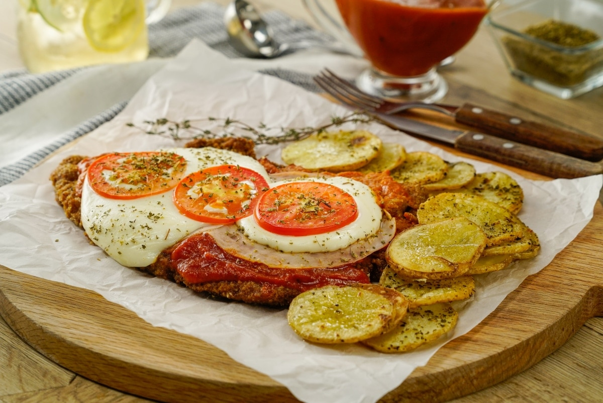
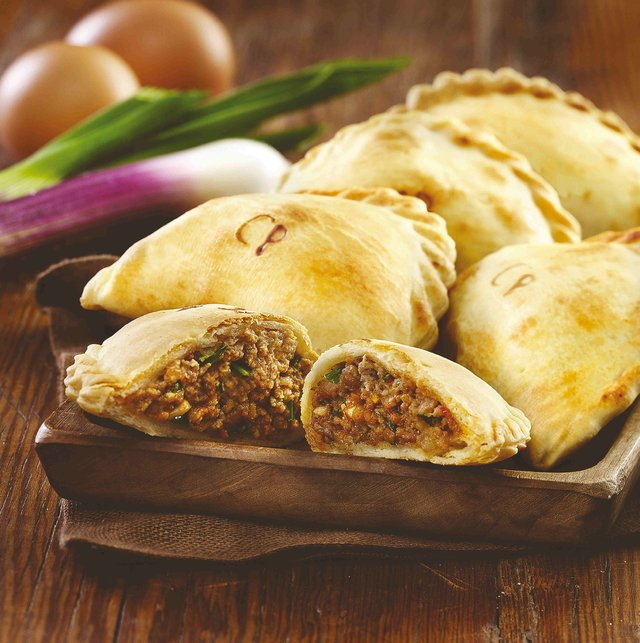
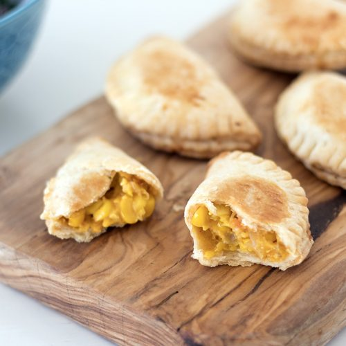

# What is this page about?
Hopefully this page will serve as a small introduction to who I am and some of my interests.

## Table of contents
- [A little about myself](#about-me)
- [Favorite food](#favorite-food)

### About me
I'm Matias Lin and I'm currently in my third year studtying bioinformatics. I was born in Buenos Aires, Argentina and I lived there basically my whole life before moving here for college. 

### Favorite food
Having lived in Argentina for more than 17 years, it is not surprising that I collected quite a few of my favorite foods. This page will give provide you with a description of different Argentinian plates along with a simple recipe.

**Milanesa Napolitana**
*Milanesa napolitana* is similar to veal parmesan, but with South American touches. After the steak is breaded and fried, it's topped with a slice of ham, tomato sauce, and melted mozzarella cheese, and served with french fries. Leftovers make great sandwiches, especially when paired with a soft but crusty roll. ~~Milanesa a la Napolitana does not originate from Milan or Naples~~; it's thought to have been invented in the 1940s at a Buenos Aires. When I was in Argentina we used to say: 
> "Che, querés ir a comer una *napo*"?

You can read more about *Milanesa napolitana* [here](https://www.thespruceeats.com/milanesa-napolitana-argentinian-fried-steak-3029473?utm_source=emailshare&utm_medium=social&utm_campaign=shareurlbuttons).

**Empanadas**
*Empanadas* are hand-sized savory pies that can be found all over South America. In Argentina, every province has its own variety. All follow the same basic culinary guideline — a soft pocket of dough that’s stuffed with a scrumptious, savory filling. There are a lot of variations to this kind of food but some of my favorites have the following fillings: "*carne picante*" and "*humita*".

  
  

You can read more about *Empanadas* [here](https://theculturetrip.com/south-america/argentina/articles/a-brief-history-of-the-empanada/).
